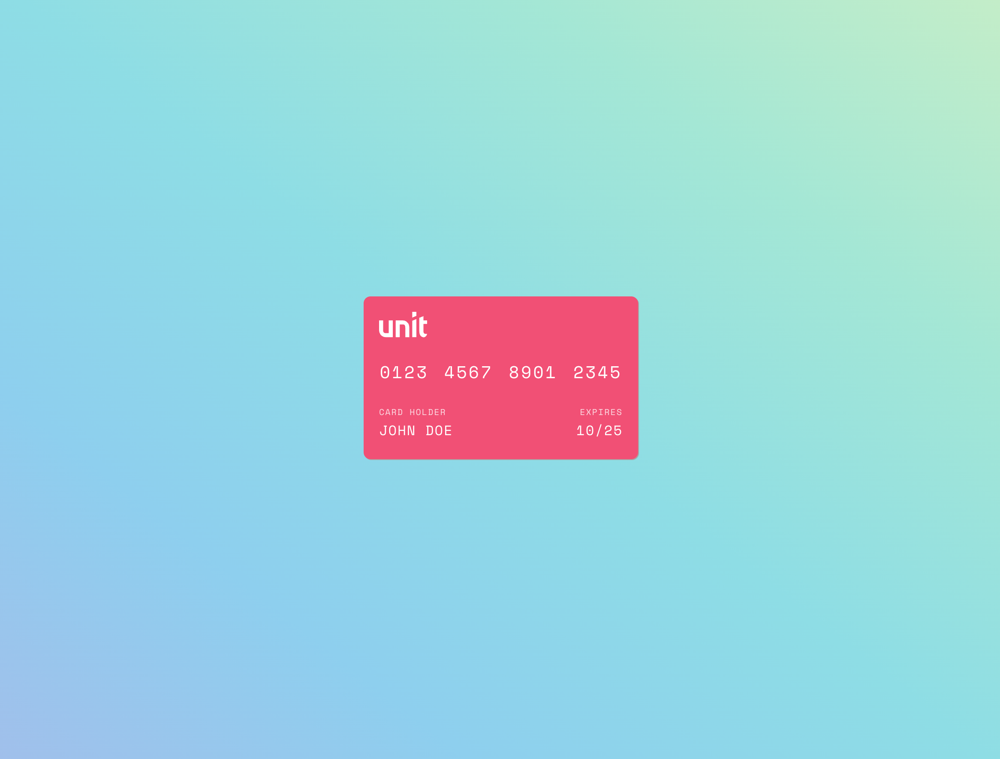
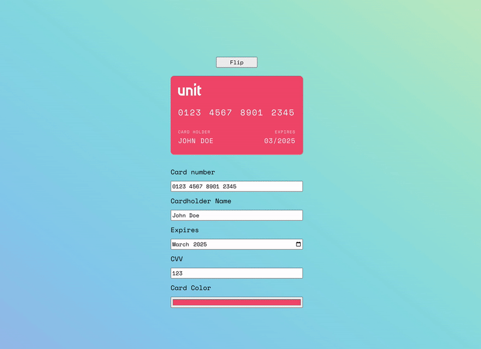

# Unit Frontend Home Task
This project has been created using the official create-react-app (`npx create-react-app project --template typescript`)
Their original README is below.

## Credit Card Live Editor
We are going to implement a lightweight version of a credit card editor.

The project already contains a design for the credit card's front and back sides.
Only the front side is currently shown, but when a certain class is added the card will flip to its back side:

### Please code the following improvements:

1. Directly above the card, implement a "Flip" button that toggles the card's direction (front / back).
2. Create the following input fields under the card:
   1. Card number (masked and formatted according to a credit card number)
   2. Cardholder Name (English letters only, maximum 16 chars)
   3. Expires (month & year)
   4. CVV (3 numbers)
   5. Card Color
3. Each of the fields should be shown live on the card itself while being edited.
4. Whenever the "CVV" field is focused, the card should flip to its back side.
5. Also, whenever the "Card Number", "Cardholder Name" name or "Expires" fields are focused, the card should flip to its front side. 

There are no special requirements for the design of the fields, but each field should take one row, and labels should be placed above them.   

You may install and use any npm libraries or controls that you wish and are comfortable with if needed.

Below is one possible solution (solution.gif):

Good luck! :)

          

## Getting Started with Create React App

This project was bootstrapped with [Create React App](https://github.com/facebook/create-react-app).

## Available Scripts

In the project directory, you can run:

### `npm start`

Runs the app in the development mode.\
Open [http://localhost:3000](http://localhost:3000) to view it in the browser.

The page will reload if you make edits.\
You will also see any lint errors in the console.

### `npm test`

Launches the test runner in the interactive watch mode.\
See the section about [running tests](https://facebook.github.io/create-react-app/docs/running-tests) for more information.

### `npm run build`

Builds the app for production to the `build` folder.\
It correctly bundles React in production mode and optimizes the build for the best performance.

The build is minified and the filenames include the hashes.\
Your app is ready to be deployed!

See the section about [deployment](https://facebook.github.io/create-react-app/docs/deployment) for more information.

### `npm run eject`

**Note: this is a one-way operation. Once you `eject`, you can’t go back!**

If you aren’t satisfied with the build tool and configuration choices, you can `eject` at any time. This command will remove the single build dependency from your project.

Instead, it will copy all the configuration files and the transitive dependencies (webpack, Babel, ESLint, etc) right into your project so you have full control over them. All of the commands except `eject` will still work, but they will point to the copied scripts so you can tweak them. At this point you’re on your own.

You don’t have to ever use `eject`. The curated feature set is suitable for small and middle deployments, and you shouldn’t feel obligated to use this feature. However we understand that this tool wouldn’t be useful if you couldn’t customize it when you are ready for it.

## Learn More

You can learn more in the [Create React App documentation](https://facebook.github.io/create-react-app/docs/getting-started).

To learn React, check out the [React documentation](https://reactjs.org/).
